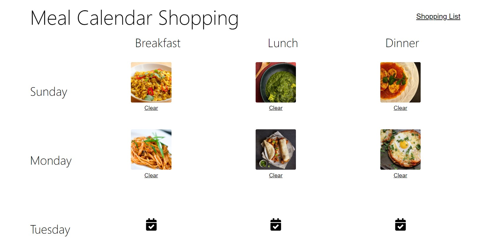
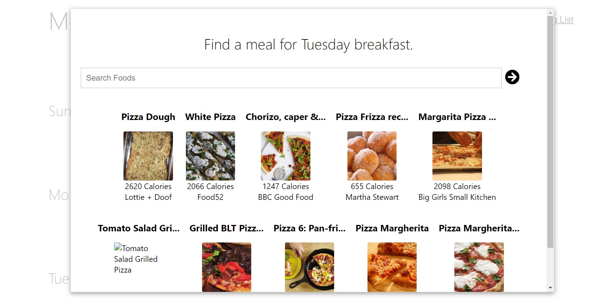
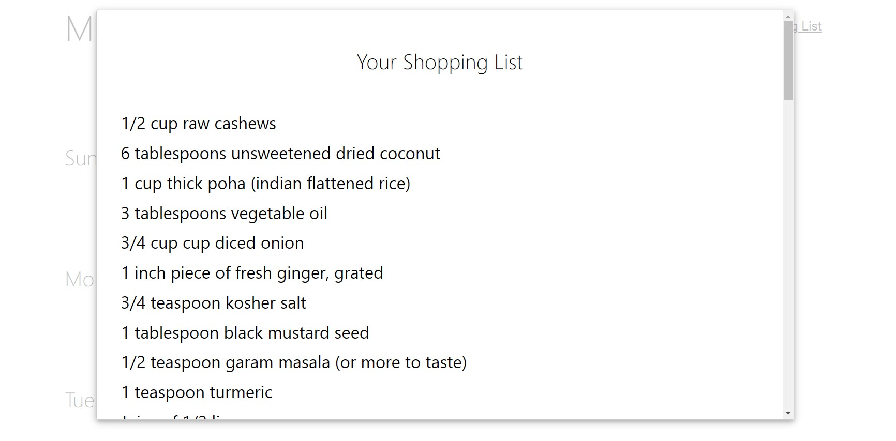

## UdaciMeals

A udacity learning project which helps to make Meal Time Table for the week and it automatically generate shopping List. Users will leverage [Edamam's Recipe Search API](https://developer.edamam.com/edamam-recipe-api) to add meals, then generate a shopping list of ingredients based on the meals chosen.

### How to Run: 
1. Clone the Repo or Download
2. Get the API ID and APP Key obtained from the [Edamam's Recipe Search API](https://developer.edamam.com/edamam-recipe-api).
3. Replace the `YOUR-API-ID` and `YOUR-APP-KEY` with the Key and Id  in the `.env` file.
4. Run `npm install` to install the project dependencies.
5. Run the app using `npm start run`.
6. App can be seen at: `http://localhost:3000`.

### Screenshots

